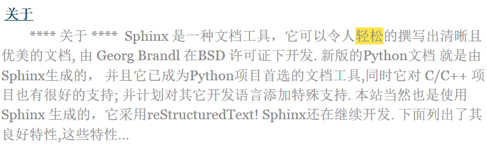
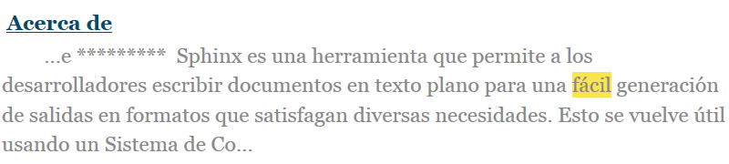

sphinx.search.zh_CN
===================

让sphinx支持简体中文搜索的插件。

截图
----

1. 中文搜索

2. 英文搜索

3. latin-1 字符搜索

安装
----

1. 安装 结巴中文分词 ``pip install jieba``

2. 复制 ``zh_CN.py`` 到 sphinx 的 search 目录下，如： ``C:\Python27\Lib\site-packages\sphinx\search``

3. 打开 ``search`` 目录下的 ``__init__.py``
   找到：
   ::

    from sphinx.search import en, ja
    languages = {
        'en': en.SearchEnglish,
        'ja': ja.SearchJapanese,
    }

   修改成：
   ::

    from sphinx.search import en, ja, zh_CN
    languages = {
        'en': en.SearchEnglish,
        'ja': ja.SearchJapanese,
        'zh_CN': zh_CN.SearchChinese
    }

4. 在 sphinx 工程的 ``conf.py`` 中写上 ``language = 'zh_CN'`` ，然后就可以 ``make html`` 了。

繁体
----

结巴中文分词支持繁体词库分词，如有需要，请使用支持繁体分词更好的词典文件：
https://github.com/fxsjy/jieba/raw/master/extra_dict/dict.txt.big

覆盖 ``jieba/dict.txt`` 即可或者用 ``jieba.set_dictionary('data/dict.txt.big')``
你可以自己生成一份 ``zh_TW.py`` 文件。

